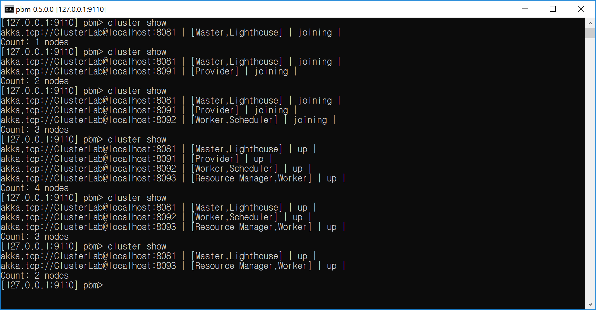

## Cluster을 구성하기 위한 최소 Role의 Node 개수 지정하기.
1. 기본 값은 없다. 
   - <role-name>은 대/소문자를 구분한다.
   - AND 조건이다.
   - 공백이 있을 때는 '"'을 사용한다. 예. **"Resource Manager".min-nr-of-members = 1**
```
	role {
		#
		# Minimum required number of members of a certain role before the leader
		# changes member status of 'Joining' members to 'Up'. Typically used together
		# with 'Cluster.registerOnMemberUp' to defer some action, such as starting
		# actors, until the cluster has reached a certain size.
		# E.g. to require 2 nodes with role 'frontend' and 3 nodes with role 'backend':
		#   frontend.min-nr-of-members = 2
		#   backend.min-nr-of-members = 3
		#<role-name>.min-nr-of-members = 1
	}
```

2. AND 조건이다.
   - front-end Role이 2개 이상이고 worker Role이 1개 이상일 때 Cluster을 구성한다.
```
    role {
        front-end.min-nr-of-members = 2
	worker.min-nr-of-members = 1
    }
```	
 
<br/>
<br/>

## 데모 시나리오
   - Role 정보

 Node | Port | Role 
-----|-----|-----
 SeedNode1 | 8081 | Master, Lighthouse 
 NonSeedNode1 | 8091 | Provider 
 NonSeedNode2 | 8092 | Worker, Scheduler 
 NonSeedNode3 | 0893 | Worker, Resource Manager 

- Per-Role Minimum Size 설정
   - AND 조건을 만족하기 전까지는 "Joining" 상태가 된다.
   - 클러스터가 구성된 이후 최소 개수는 무시된다(8091, 8092 포트 Node가 클러스터에서 제거된 후에도 클러스터는 유지된다).
```
		role {
			provider.min-nr-of-members = 1
			worker.min-nr-of-members = 2
		}
```
  
