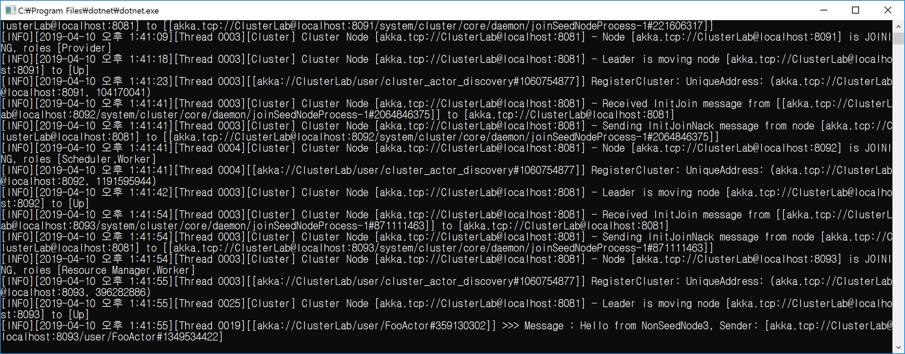
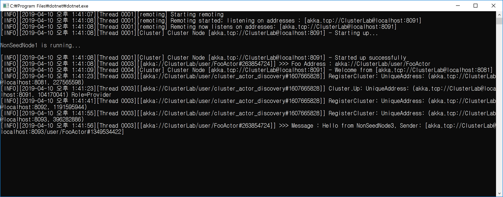
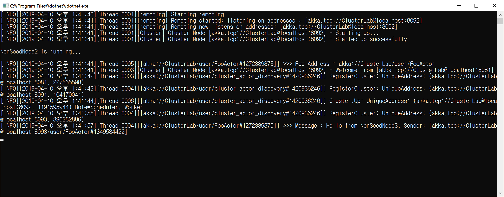
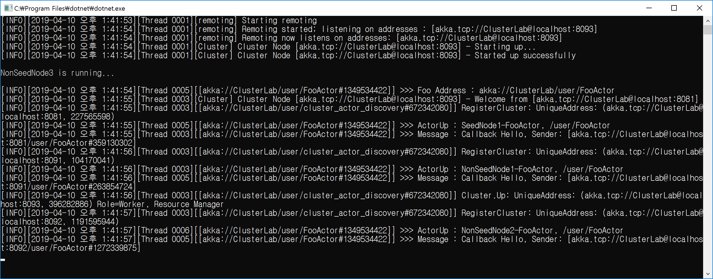

## 다른 Node에 있는 액터를 찾는다.

1. 모든 Node에 "ClusterActorDiscovery" 액터를 생성한다.
```cs
var cluster = Cluster.Get(system);
IActorRef clusterActorDiscovery = system.ActorOf(Props.Create(() => new ClusterActorDiscovery(cluster)), "cluster_actor_discovery");
```

2. 관심 액터를 등록한다.
```cs
//
// "SeedNode1-FooActor"은 클러스터 환경에서 유일한 식별 값이어야 한다.
//
_clusterActorDiscovery.Tell(new ClusterActorDiscoveryMessage.RegisterActor(Self, "SeedNode1-FooActor"));
```
	
3. 관심 액터 찾기를 감시한다.
```cs
_clusterActorDiscovery.Tell(new ClusterActorDiscoveryMessage.MonitorActor("SeedNode1-FooActor"));
```

4. 관심 액터가 클러스터에 합류/제거를 인식한다.
```cs
Receive<ClusterActorDiscoveryMessage.ActorUp>(_ => Handle(_));
Receive<ClusterActorDiscoveryMessage.ActorDown>(_ => Handle(_));
			
private void Handle(ClusterActorDiscoveryMessage.ActorUp msg)
{
	...
}

private void Handle(ClusterActorDiscoveryMessage.ActorDown msg)
{
	...
}
```
	
<br/>
<br/>
		
## 데모 시나리오.
1. 관심 액터를 등록한다.
	SeedNode1, NonSeedNode1, NonSeedNode2
1. 관심 액터를 감시한다(합류를 인식한다)
	NonSeedNode3
1. NonSeedNode3에서 다른 Node에 있는 관심 액터에게 메시지를 보낸다.

  - SeedNode1


  - NonSeedNode1


  - NonSeedNode2


  - NonSeedNode3

