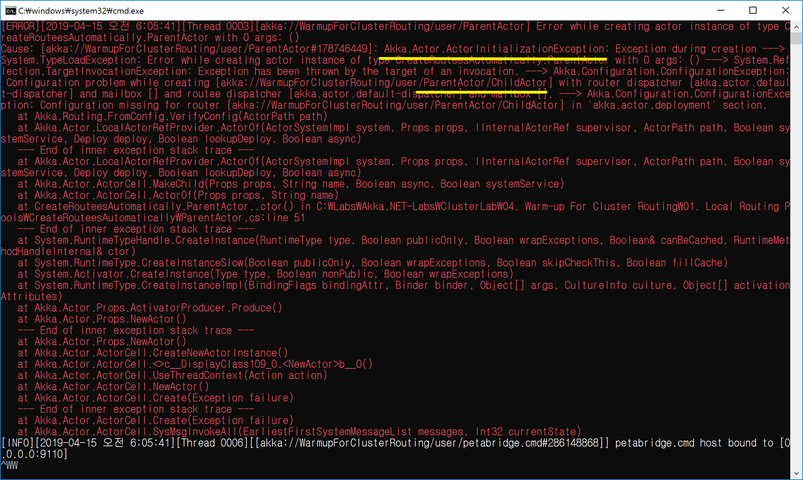
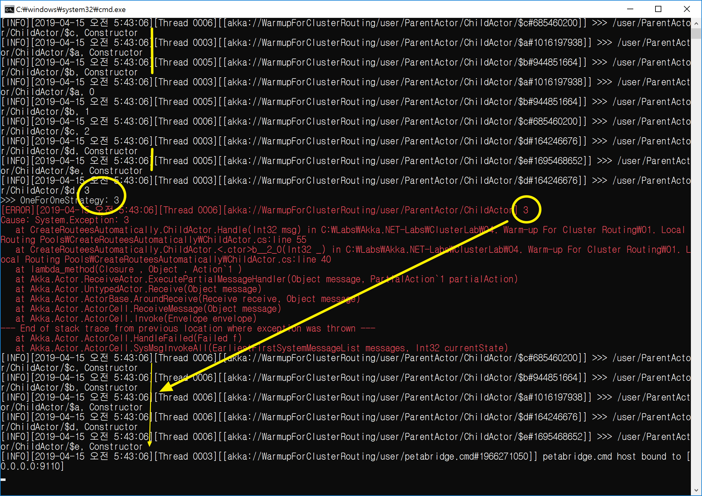

## 자동으로 액터를 생성하여 라우팅하기
1. 환경 설정을 한다.
   - akka.actor.deployment.<액터경로>.router = ... -pool
   - akka.actor.deployment.<액터경로>.nr-of-instances = <값>
```
akka {
	actor {
		deployment {
			/ParentActor/ChildActor {
				router = round-robin-pool
				nr-of-instances = 5
			}
		}
	}
}
``

2. 자동으로 Routee를 생성시킨다.
   - .WithRouter(FromConfig.Instance);
```
return Akka.Actor.Props.Create(() => new ChildActor())
  .WithRouter(FromConfig.Instance);
```

3. Router와 Routee 구조
   - /user/ParentActor/ChildActor/$a
   - Router: ChildActor, **.WithRouter(FromConfig.Instance);**
   - Routee: $a
   
4. Router 기본 장애 전략은 "Directive.Escalate"이다.
   - Routee 장래를 Router가 처리하지 않고 Router 부모에게 전달하는 것이다.
   - Router 부모는 Routee 장애 전략을 수립해야 한다.
```
.WithSupervisorStrategy(new OneForOneStrategy(ex =>
   {
      return Directive.Escalate;
   })
```

5. Router의 기존 장애 처리 전략 "Escalate"을 변경하고 싶다면, Router 전략 객체에 지정하면 된다.
```	
.WithRouter(FromConfig.Instance.WithSupervisorStrategy(new OneForOneStrategy(ex =>
{
    //
    // 장애 처리 전략을 수립한다.
    //
    return Directive.Stop;
})));

7. 환경 설정 파일에 있는 Router 전략 사용하기
```
using Akka.Routing;

.WithRouter(FromConfig.Instance)
```

7. WithSupervisorStrategy vs. override SupervisorStrategy 함수 호출 우선 순위
   - WithSupervisorStrategy > override SupervisorStrategy 함수

8. 환경 설정에 지정된 액터 경로가 일치하지 않으면 예외가 발생한다.
   - Akka.Actor.ActorInitializationException


<br/>
<br/>

## 데모
1. /user/ParentActor/ChildActor1, ... 5개를 만든다.
2. 메시지 0, 1, 2, 3을 Routee에게 Round-robin으로 보낸다.
3. "3"일 때 예외를 발생시킨다.
4. 예외가 발생되면 One For One 전략으로 처리한다.
   - Router가 재시작하기 때문에 모든 Routee가 재시작한다.



