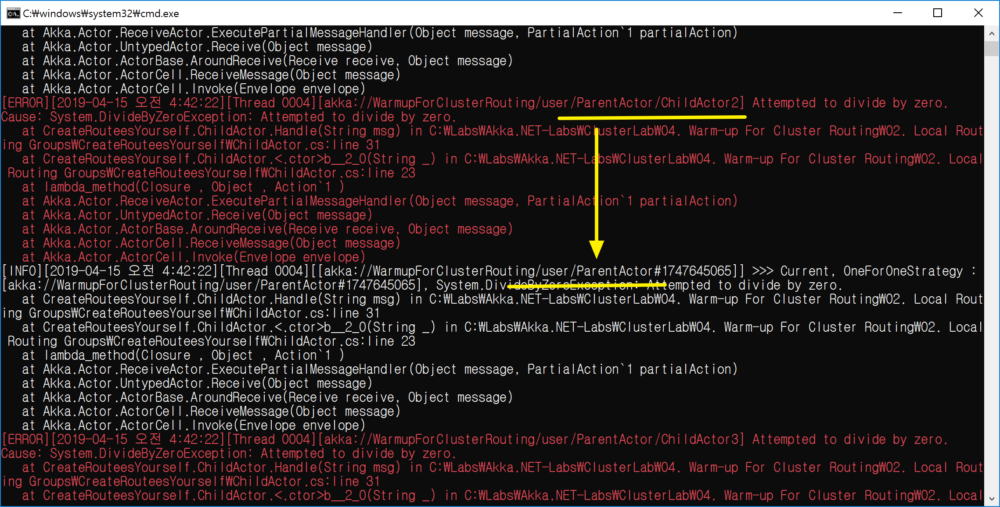

## 생성된 액터로 라우팅하기
1. 생성된 액터 경로를 명시한다.
   - akka.actor.deployment.<액터경로>.routees.paths = [ ... ]
```
akka {
	actor {
		deployment {
			/MyGroupRouterActor {

				#
				# 반드시 "... - group"으로 지정해야 한다.
				#
				router = round-robin-group

				#
				# Routee 경로를 지정한다.
				#
				routees.paths = [
					/user/ParentActor/ChildActor1,
					/user/ParentActor/ChildActor2,
					/user/ParentActor/ChildActor3
				]
			}
		}
	}
}
```

2. Group Router 액터를 생성한다.
   - Props.Empty.WithRouter(FromConfig.Instance)
```
var roundRobinGroupActor = system.ActorOf(Props.Empty
		.WithRouter(FromConfig.Instance),
		"MyGroupRouterActor");
```

3. Group Routee(ChildActor1)에서 발생되는 예외는 Group Router(MyGroupRouterActor)가 아닌 진짜 부모(ParentActor)에게 전달된다.
   - Group Routee: /user/ParentActor/ChildActor1
   - Group Router: /user/MyGroupRouterActor
  
<br/>
<br/>

## 데모
1. 데모 액터 구조
	/user/ParentActor
	/user/ParentActor/ChildActor1
	/user/ParentActor/ChildActor2
	/user/ParentActor/ChildActor3

	Props.Empty
	/user/MyGroupRouterActor

1. Router vs. Routee
| Group Router  | Group Routee  |
|---|---|
| MyGroupRouterActor | ChildActor1, ChildActor2, ChildActor3 |

1. ChildActor1, 2, 3에서 예외가 발생되면 ParentActor의 SupervisorStrategy가 호출된다.


