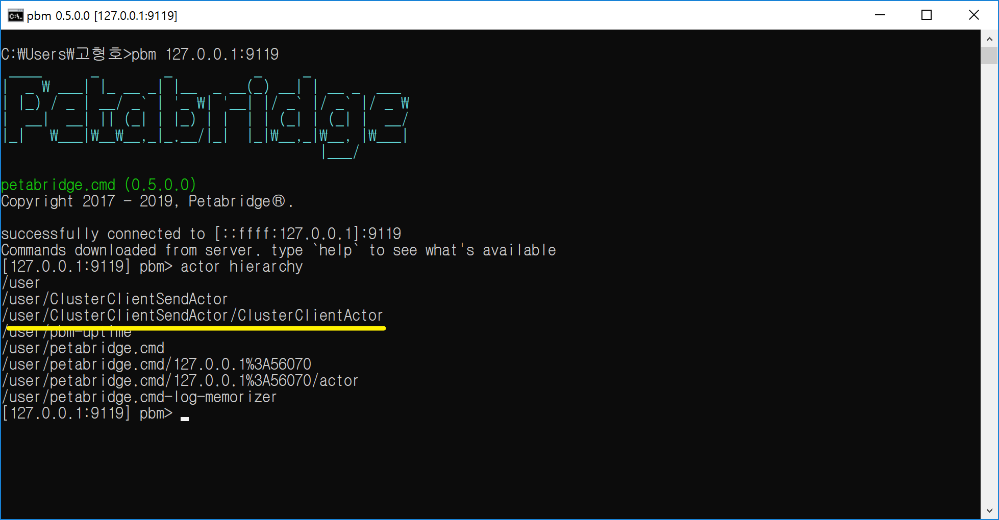
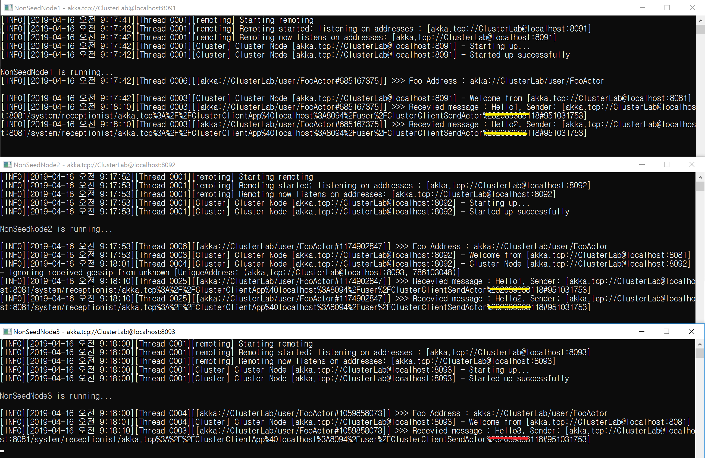

## Cluster 밖에서 Cluster와 통신하기
1. Akka.Cluster.Tools NuGet 패키지를 설치한다.

2. NuGet 패키지를 환경 설정에 추가한다.
```
akka.extensions = ["Akka.Cluster.Tools.Client.ClusterClientReceptionistExtensionProvider, Akka.Cluster.Tools"]
```

3 노드에서 통신할 액터를 Topic 기준으로 등록한다.
```
IActorRef fooActor = ...

// 등록 함수: RegisterSubscriber
// 해제 함수: UnregisterSubscriber
ClusterClientReceptionist.Get(system).RegisterSubscriber("Topic1", fooActor);
```

4. 접속할 Cluster 정보를 환경 설정에 추가한다.
```
akka {
	...

	extensions = ["Akka.Cluster.Tools.Client.ClusterClientReceptionistExtensionProvider, Akka.Cluster.Tools"]
	cluster {
		client {
			initial-contacts = [
				"akka.tcp://ClusterLab@localhost:8081/system/receptionist"
			]
		}
	}
}
```
- 접속이 성공하면 다음과 같은 로그가 출력된다.


5. Cluster에게 메시지를 보낼 액터를 생성한다.
```
var c = Context.ActorOf(
	ClusterClient.Props(ClusterClientSettings.Create(Context.System)),
	"ClusterClientActor");
```
- Cluster 통신을 위한 전용 액터 생성을 확인한다.


6. Cluster의 특정 경로 액터에게 메시지를 보낸다.
   - ClusterClient.Publish: Topic 이름 기준으로 등록된 모든 액터에게 메시지를 보낸다. 
```
c.Tell(new ClusterClient.Publish("Topic1", "Hello1"));
```

<br/>
<br/>

## 데모
1. 데모 실행 이미지


