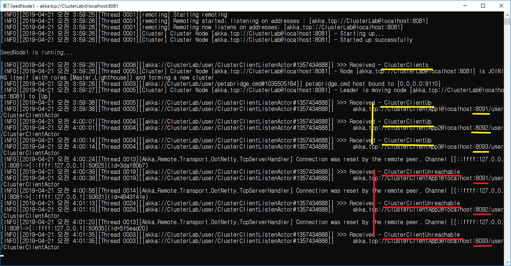

## ClusterClient 이벤트 처리하기
1. 주요 기능 정리
   - ClusterClientReceptionist 액터 핸들을 얻는다: ClusterClientReceptionist.Get(Context.System).Underlying
   - ClusterClientReceptionist 액터에게 이벤트를 등록한다: _receptionistActor.Tell(SubscribeClusterClients.Instance);
```
_receptionistActor = ClusterClientReceptionist.Get(Context.System).Underlying;

// 
// 이벤트 등록: SubscribeClusterClients.Instance
//      -> Receive<ClusterClients>
//      -> Receive<ClusterClientUp>
//      -> Receive<ClusterClientUnreachable >
// 이벤트 제거: UnsubscribeClusterClients.Instance
//
//   vs.
//
// 명시적 확인 : GetClusterClients.Instance
//      -> 
_receptionistActor.Tell(SubscribeClusterClients.Instance);
```

<br/>
<br/>

## 데모
1. SeedNode1을 실행한다(ClusterClients 메시지가 발생한다).
1. ClusterClient1을 실행한다(ClusterClientUp 메시지가 발생된다).
1. ClusterClient2을 실행한다(ClusterClientUp 메시지가 발생된다).
1. ClusterClient3을 실행한다(ClusterClientUp 메시지가 발생된다).
1. ClusterClient1을 종료한다(ClusterClientUnreachable 메시지가 발생한다). 
1. ClusterClient2을 종료한다(ClusterClientUnreachable 메시지가 발생한다).
1. ClusterClient3을 종료한다(ClusterClientUnreachable 메시지가 발생한다).

