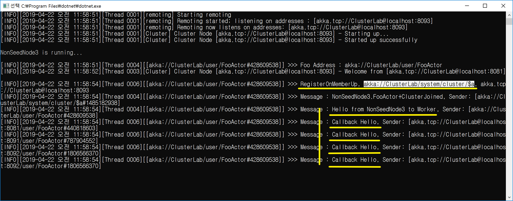

## Role과 Path로 메시지 보내기
1. Cluster 멤버를 조회한다.
```
Cluster cluster = Cluster.Get(Context.System);
IEnumerable<Member> members = cluster.State.Members.Where(member => member.Roles.Contains(roleName));
foreach (Member member in members)
{
	Context
		.ActorSelection($"{member.Address}/user/FooActor")
		.Tell(message);
}
```

2. Gossip Event 호출 람다의 Self 주소를 반드시 확인해야 한다.
   - RegisterOnMemberUp 람다의 Self는 "**/system/cluster/$a**" 이다.
```
//
// Cluster로 합류할 때 액터를 찾는다.
// RegisterOnMemberUp에서 호출되는 람다 Self 주소는 akka://ClusterLab/system/cluster/$a 이다.
//
IActorRef self = Self;
Cluster cluster = Cluster.Get(Context.System);
cluster.RegisterOnMemberUp(() =>
	{
		_log.Info($">>> RegisterOnMemberUp, {Self.Path}, {cluster.SelfAddress}");
		self.Tell(new ClusterJoined());
	});
```
<br/>
<br/>

## 데모
1. NonSeedNode3에서 Master 역할자(SeedNode1)에게 메시지를 보낸다.
```
// SeedNode1
SendByRoleAndPath("Master", "/user/FooActor", "Hello from NonSeedNode3 to Master");
```
2. NonSeedNode3에서 Provider 역할자(NonSeedNode1)에게 메시지를 보낸다.
```
// NonSeedNode1
SendByRoleAndPath("Provider", "/user/FooActor", "Hello from NonSeedNode3 to Provider");
```
3. NonSeedNode3에서 Worker 역할자(NonSeedNode2, NonSeedNode3)에게 메시지를 보낸다.
```
// NonSeedNode2, NonSeedNode3(Call back 메시지를 보내지 않는다)
SendByRoleAndPath("Worker", "/user/FooActor", "Hello from NonSeedNode3 to Worker");
```
4. NonSeedNode3에서 Scheduler 역할자(NonSeedNode2)에게 메시지를 보낸다.
```
// NonSeedNode2
SendByRoleAndPath("Scheduler", "/user/FooActor", "Hello from NonSeedNode3 to Worker");
```

