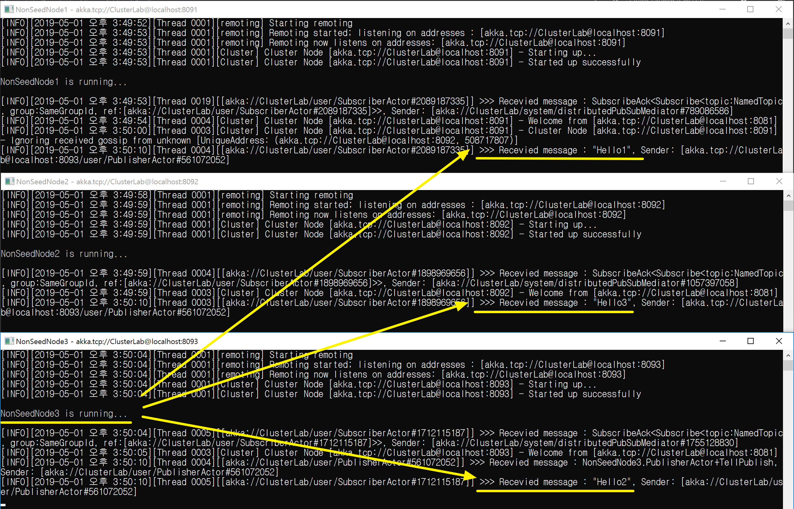

## Topic과 Group 이름으로 메시지 보내기/받기
1. Topic을 등록한다.
   - public Subscribe(string topic, IActorRef @ref, `string group = null`)
   ```
   var mediator = DistributedPubSub.Get(Context.System).Mediator;
   mediator.Tell(new Subscribe("NamedTopic", Self, "SameGroupId"));
   ```
1. Topic 등록을 확인한다.
   - SubscribeAck
   - msg.Subscribe.Group.Equals("SameGroupId")
   ```
   Receive<SubscribeAck>(_ => Handle(_));
   
   private void Handle(SubscribeAck msg)
   {
      if (msg.Subscribe.Topic.Equals("NamedTopic")
   	     && msg.Subscribe.Ref.Equals(Self)
   	     && msg.Subscribe.Group.Equals("SameGroupId"))
      {
   	     _log.Info($">>> Recevied message : {msg}, Sender: {Sender}");
      }
   }
   ```
1. Topic으로 메시지를 보낸다.
   - Group 이름이 같을 때는 한 액터에게만 메시지가 발송된다.
   - If all the subscribed actors have the same group id, then this works just like Send and each message is only delivered to one subscriber.
   ```
   var mediator = DistributedPubSub.Get(Context.System).Mediator;
   mediator.Tell(new Publish(
      "NamedTopic",               // Topic
      "Hello1",                       // 메시지
      sendOneMessageToEachGroup: true));   // 그룹 사용
   ```

<br/>
<br/>

## 데모
1. NonSeedNode1, NonSeedNode2에서 같은 Group과 Topic을 등록한다.
2. NonSeedNode3에서 `sendOneMessageToEachGroup: true`로 Topic으로 메시지를 보낸다.
- Send (local: true)와 같다.

   | NonSeedNode1 | NonSeedNode2 |
   |:--:|:--:|
   | NamedTopic | NamedTopic |
   | SameGroupId | SameGroupId |


